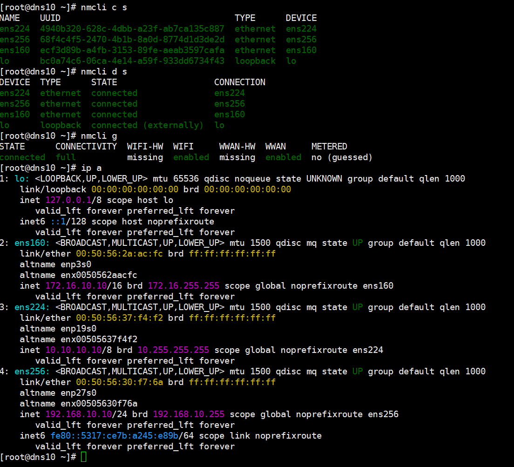
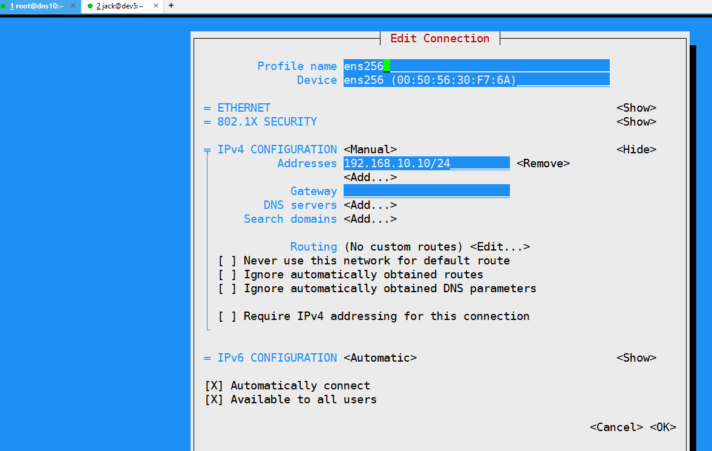
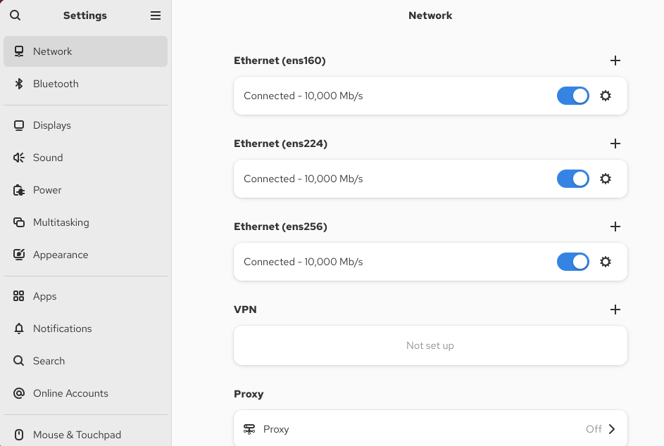

# 通用Rocky Linux 10 安装和配置

## 1.0 永久关闭selinux

编辑配置文件：使用文本编辑器打开SELinux 的配置文件`/etc/selinux/config`，例如`sudo vim /etc/selinux/config`。
修改模式参数：找到SELINUX=这一行，根据需求将其值修改为`enforcing（强制模式）、permissive（宽容模式）或disabled（关闭模式）`。
保存并重启：保存文件后，重启系统使配置生效，命令为`sudo reboot`。

验证selinux是否关闭

```shell
## 检查SELinux状态
[root@dns10 ~]# sestatus
SELinux status:                 disabled
```
如果输出中显示SELinux状态为disabled，则表示SELinux已成功关闭。

## 1.1 创建用户jack，并设置密码为1，并为jack添加sudo权限

这里是创建用户jack，并设置密码为1的命令。
```shell
## 创建用户jack
# 创建用户 jack
sudo useradd -m jack

# 设置密码为 1（系统会提示您输入两次密码）
sudo passwd jack
```

为用户添加 sudo 权限
```shell
# 方法一：直接编辑 sudoers 文件（推荐）
sudo visudo

# 在打开的文件中找到以下行：
# root    ALL=(ALL)       ALL

# 在其下方添加：
jack    ALL=(ALL)       ALL

# 保存并退出（通常是按 Ctrl+O 保存，Ctrl+X 退出）
```

```shell
# 方法二：将用户添加到 wheel 组（Rocky Linux 默认配置）
sudo usermod -aG wheel jack
```

验证配置
```shell
# 切换到 jack 用户
su - jack

# 验证 sudo 权限
sudo whoami

# 如果配置正确，应该显示 "root"
```

查看相关的配置文件
```shell
# 查看所有用户
cat /etc/passwd

# 查看用户组
groups jack

# 查看 sudoers 配置
sudo cat /etc/sudoers | grep -E '^jack|^root'
```

参考资料
- [豆包AI 如何永久关闭selinux](如何永久关闭selinux.md)
- [豆包AI Rocky Linux 用户管理指南](../80-RockyLinux使用相关/RockyLinux用户管理指南.md)

## 1.2 Rocky Linux 10 更换国内的软件源
简单步骤,更换阿里云的国内源.
```shell
## 1 备份现有的配置文件
[root@dns10 etc]# cp -r yum.repos.d yum.repos.d.bak
[root@dns10 etc]# ls -dl yum.repos*
drwxr-xr-x. 2 root root 4096 Sep 29 13:55 yum.repos.d
drwxr-xr-x  2 root root 4096 Sep 29 14:15 yum.repos.d.bak
## 2.0 删除旧的配置文件
```shell
[root@dns10 yum.repos.d]# ls
epel.repo      epel-testing.repo  rocky-devel.repo   rocky-extras.repo.bak  rocky.repo.bak
epel.repo.bak  rocky-addons.repo  rocky-extras.repo  rocky.repo
[root@dns10 yum.repos.d]# rm -rf *
[root@dns10 yum.repos.d]# ls

## 3.0 添加新的配置文件
[root@dns10 yum.repos.d]# tee /etc/yum.repos.d/rocky-aliyun.repo <<-'EOF'
[baseos]
name=Rocky Linux $releasever - BaseOS - Aliyun
baseurl=https://mirrors.aliyun.com/rockylinux/$releasever/BaseOS/$basearch/os/
gpgcheck=1
enabled=1
gpgkey=file:///etc/pki/rpm-gpg/RPM-GPG-KEY-rockyofficial

[appstream]
name=Rocky Linux $releasever - AppStream - Aliyun
baseurl=https://mirrors.aliyun.com/rockylinux/$releasever/AppStream/$basearch/os/
gpgcheck=1
enabled=1
gpgkey=file:///etc/pki/rpm-gpg/RPM-GPG-KEY-rockyofficial

[extras]
name=Rocky Linux $releasever - Extras - Aliyun
baseurl=https://mirrors.aliyun.com/rockylinux/$releasever/extras/$basearch/os/
gpgcheck=1
enabled=1
gpgkey=file:///etc/pki/rpm-gpg/RPM-GPG-KEY-rockyofficial
EOF

## 4.0 验证配置
[root@dns10 yum.repos.d]# yum repolist enabled
repo id                                              repo name
appstream                                            Rocky Linux 10 - AppStream - Aliyun
baseos                                               Rocky Linux 10 - BaseOS - Aliyun
extras                                               Rocky Linux 10 - Extras - Aliyun

## 5.0 测试安装 并构建缓存
```shell
[root@dns10 yum.repos.d]# dnf clean all & dnf makecache
[1] 5621
21 files removed
Rocky Linux 10 - BaseOS - Aliyun                                                                     17 MB/s |  19 MB     00:01    
Rocky Linux 10 - AppStream - Aliyun                                                                 4.5 MB/s | 2.1 MB     00:00    
Rocky Linux 10 - Extras - Aliyun                                                                     24 kB/s | 5.4 kB     00:00    
Metadata cache created.
[1]+  Done                    dnf clean all

```

同理更换国内的epel源，也非常简单.
```shell
[root@dns10 yum.repos.d]# dnf remove -y epel-release && dnf install -y epel-release
...
[root@dns10 yum.repos.d]# ls
epel.repo  epel-testing.repo  rocky-aliyun.repo
[root@dns10 yum.repos.d]#  dnf repolist enabled | grep -E "baseos|appstream|extras|epel"
appstream            Rocky Linux 10 - AppStream - Aliyun
baseos               Rocky Linux 10 - BaseOS - Aliyun
epel                 Extra Packages for Enterprise Linux 10 - x86_64
extras               Rocky Linux 10 - Extras - Aliyun
```

验证测试软件安装（观察下载地址含 aliyun）
```shell
## net-tools 需要从appstream源下载
[root@dns10 yum.repos.d]# dnf install -y net-tools
## htop需要从epel源下载
[root@dns10 yum.repos.d]# dnf install -y htop
Last metadata expiration check: 0:00:20 ago on Mon 29 Sep 2025 02:26:22 PM CST.
..
```

参考：[豆包AI Rocky Linux 10 换国内软件源](../80-RockyLinux使用相关/RockyLinux10更换国内软件源.md)

## 1.3 关闭Rocky Linux 10防火墙
```shell
由于是本地测试环境，为了使用翻遍，所以关闭防火墙。
[root@dns10 ~]# systemctl stop firewalld
[root@dns10 ~]# systemctl disable firewalld
[root@dns10 yum.repos.d]# systemctl status firewalld.service 
○ firewalld.service - firewalld - dynamic firewall daemon
     Loaded: loaded (/usr/lib/systemd/system/firewalld.service; disabled; preset: enabled)
     Active: inactive (dead)
       Docs: man:firewalld(1)

```
参考：[豆包AI Rocky Linux 10 关闭防火墙](../80-RockyLinux使用相关/RockyLinux10关闭防火墙.md)

## 1.4 Rocky Linux 10网络静态ip设置

命令行工具`nmcli`

```shell
## 查看当前网络配置
# 设备-链路层
nmcli d status
# 连接-网络层
nmcli c show

## 验证配置
ip a
```

字符界面工具`nmtui`


图形界面工具`nm-connection-editor`


参考：[豆包AI Rocky Linux 10 静态ip设置](../80-RockyLinux使用相关/RockyLinux10网络及静态ip设置.md)

## 1.5 Rocky Linux 10配置主机名

```shell
[jack@dev5 ~]$ sudo hostnamectl set-hostname dev5.ilovemyhome.top --static
[jack@dev5 ~]$ hostname
dev5.ilovemyhome.top
```

参考[豆包AI Rocky Linux 10 设置主机名](../80-RockyLinux使用相关/RockyLinux10设置主机名.md)

## 1.6 为jack用户生成ssh密钥对
这里为jack用户生成ssh密钥对，用于后续的免密登录。
```shell
[jack@dev5 ~]$ ssh-keygen -t rsa -P "" -f ~/.ssh/id_rsa
[jack@dev5 ~]$ ls ~/.ssh/
authorized_keys  id_rsa  id_rsa.pub  known_hosts
```


## 参考资料
- [豆包AI Rocky Linux 如何永久关闭selinux](../80-RockyLinux使用相关/RockyLinux如何永久关闭selinux.md)
- [豆包AI Rocky Linux 用户管理指南](../80-RockyLinux使用相关/RockyLinux用户管理指南.md)
