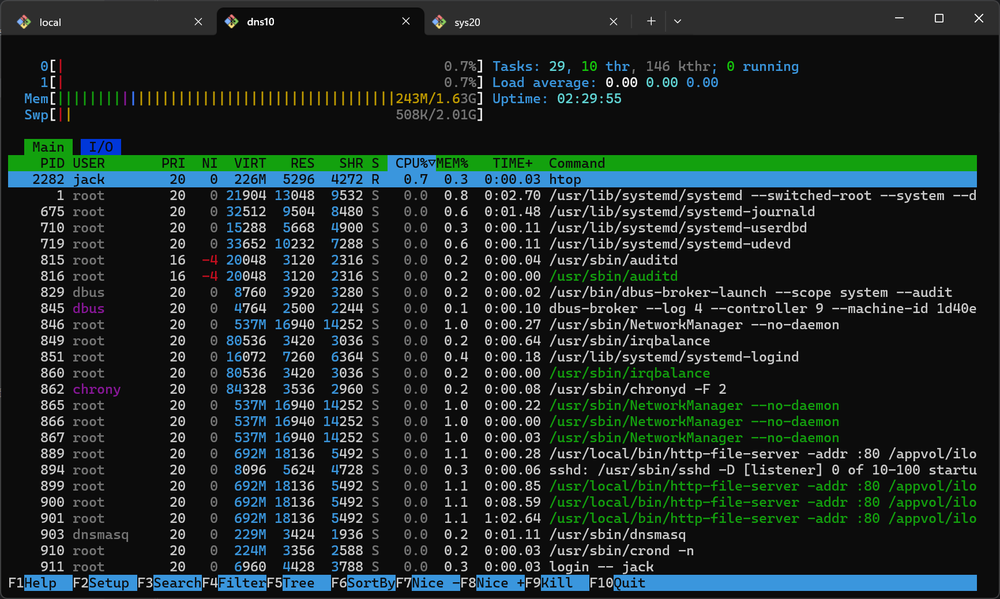

# htop
 htop是Linux系统中一款交互式进程监控工具，是传统top命令的增强版。它以直观的彩色界面实时展示系统进程状态，支持鼠标操作、进程搜索、排序、kill进程等功能

## 简单用法
```shell
[jack@dns10 appvol]$ htop
```

## 字符界面显示


## 参考资料
- [htop 官方网站](https://htop.dev/)
- [豆包AI-Linux-htop-命令详解](豆包AI-Linux-htop-命令详解.md)
