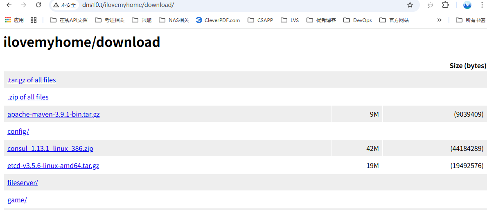

# DNS 以及文件共享服务器配置

DNS服务器作为内部域名服务器。
- 主要的功能就是为内部的主机提供域名解析服务，实现域名自由。
- 文件共享服务，实现文件共享自由。
- 

## 1.服务器规格

```text
OS : RockLinux 10.1, 2CPU, 4G Memory, 200GB SSD Disk
```

| 资源配置情况       | 规格                                 | 说明           |
|--------------|------------------------------------|--------------|
| Architecture | x86_64                             | x86_64架构     |
| CPU          | 2 core                             | 2个CPU核心      |
| Memory       | 4G                                 | 4GB 内存       |
| Storage      | 200GB SSD Disk                     | 200GB SSD 硬盘 |
| Hostname     | dns10.ilovemyhome.top              |              |
| 网络           | NAT,HostOnly                       | NAT 网络       |
| OS           | Rocky Linux 10.0 (Red Quartz)      |              |
| Kernel       | Linux 6.12.0-55.27.1.el10_0.x86_64 |              |

这里可以参考[豆包AI的回答 Rocky Linux 10 查看硬件情况](../80-RockyLinux使用相关/RockyLinux10查看硬件情况.md)
常见的命令包括如下:

```shell
## hostnamectl: 查看系统与硬件架构
[jack@dns10 ~]$ hostnamectl
     Static hostname: dns10.ilovemyhome.top
## lscpu：查看 CPU 详细信息
[jack@dns10 ~]$ lscpu
Architecture:             x86_64
  CPU op-mode(s):         32-bit, 64-bit
  Address sizes:          45 bits physical, 48 bits virtual
  Byte Order:             Little Endian
## free：查看内存使用与总量
[jack@dns10 ~]$ free -h
               total        used        free      shared  buff/cache   available
Mem:           3.5Gi       1.0Gi       2.3Gi        13Mi       511Mi       2.5Gi
Swap:          3.9Gi          0B       3.9Gi
## lsblk：查看磁盘与分区信息
[jack@dns10 ~]$ lsblk
NAME        MAJ:MIN RM   SIZE RO TYPE MOUNTPOINTS
sr0          11:0    1   7.1G  0 rom  
nvme0n1     259:0    0   200G  0 disk 
├─nvme0n1p1 259:1    0     1M  0 part 
## df -h：查看文件系统使用情况
[jack@dns10 ~]$ df -h
Filesystem           Size  Used Avail Use% Mounted on
/dev/mapper/rl-root   70G   13G   58G  18% /
devtmpfs             4.0M     0  4.0M   0% /dev
tmpfs                1.8G     0  1.8G   0% /dev/shm
```

## 2 网络配置情况

网络配置表

| 网卡ID   | 虚拟网络   | 虚拟网络类型   | IP               | 网关         | DNS       |
|--------|--------|----------|------------------|------------|-----------|
| ens224 | VmNet8 | NAT      | 10.10.10.10/8    | 10.10.10.2 | 127.0.0.1 |
| ens160 | VmNet1 | HostOnly | 172.16.10.10/16  | N/A        | N/A       |
| ens256 | VmNet9 | HostOnly | 192.168.10.10/24 | N/A        | N/A       |

路由情况

```shell
[jack@dns10 ~]$ ip route
default via 10.10.10.2 dev ens224 proto static metric 101 
10.0.0.0/8 dev ens224 proto kernel scope link src 10.10.10.10 metric 101 
172.16.0.0/16 dev ens160 proto kernel scope link src 172.16.10.10 metric 100 
192.168.10.0/24 dev ens256 proto kernel scope link src 192.168.10.10 metric 102 
```

## 3. 安装dnsmasq来实现dns自由

Rocky Linux 10.0 中 dnsmasq 的安装非常简单，直接使用 yum 安装即可。
```shell
[root@dns10 ~]$ sudo dnf install -y dnsmasq
```
配置也非常简单，这里贴一下。
```shell
[root@dns10 ~]$ cat /etc/dnsmasq.conf
no-resolv
no-hosts
addn-hosts=/etc/dnsmasq.hosts
server=192.168.0.1
server=114.114.114.114
server=8.8.8.8
cache-size=10000
log-queries

[root@dns10 ~]$ cat /etc/dnsmasq.hosts
# /etc/dnsmasq.hosts
172.16.10.10 dns10.ilovemyhome.top

172.16.10.5 dev5.ilovemyhome.top
172.16.10.6 dev6.ilovemyhome.top
172.16.10.188 app188.ilovemyhome.top
172.16.10.189 app189.ilovemyhome.top

```

这里ilovemyhome.top的域名太长了，打起来太不方便，可以在`/etc/dnsmasq.hosts`配置多条记录来实现。
```shell
[root@dns10 etc]# cat /etc/dnsmasq.hosts 
# /etc/dnsmasq.hosts
172.16.10.10 dns10.ilovemyhome.top

172.16.10.5 dev5.ilovemyhome.top
172.16.10.6 dev6.ilovemyhome.top
172.16.10.188 app188.ilovemyhome.top
172.16.10.189 app189.ilovemyhome.top

172.16.10.10 dns10.t
172.16.10.5 dev5.t
172.16.10.6 dev6.t
172.16.10.188 app188.t
172.16.10.189 app189.t
```
配置完成后，重启 dnsmasq 服务，并查看 dnsmasq 的状态。
```shell
[root@dns10 etc]# systemctl restart dnsmasq.service 
[root@dns10 etc]# 
[root@dns10 etc]# 
[root@dns10 etc]# nslookup dev5.t
Server:		127.0.0.1
Address:	127.0.0.1#53

Name:	dev5.t
Address: 172.16.10.5

[root@dns10 etc]# 
[root@dns10 etc]# nslookup app188.t
Server:		127.0.0.1
Address:	127.0.0.1#53

Name:	app188.t
Address: 172.16.10.188
```


参考资料
- [dnsmasq 官方文档](https://thekelleys.org.uk/dnsmasq/doc.html)
- [豆包AI Rocky Linux 10 安装dnsmasq](../92-安装的系统软件/dnsmasq/RockyLinux10安装和配置dnsmasq.md)
- [豆包AI dnsmasq与其他DNS服务器的区别](../92-安装的系统软件/dnsmasq/dnsmasq与其他DNS服务器的区别.md)

## 4 安装简单的http文件共享服务http-file-server来实现文件共享自由
`http-file-server`是一个用go语言写的非常简单的文件服务，只有一个可执行文件，安装非常简单。

```shell
[jack@dns10 ~]$ sudo cd /tmp \
&& wget https://github.com/sgreben/http-file-server/releases/download/1.6.1/http-file-server_1.6.1_linux_x86_64.tar.gz \
&& tar -zxvf http-file-server_1.6.1_linux_x86_64.tar.gz \
&& mv http-file-server /usr/local/bin/ \
&& type http-file-server
...
http-file-server is hashed (/usr/local/bin/http-file-server)
```

创建一个系统服务，并自动启动。
```shell
[jack@dns10 ~]$ sudo cat << EOF > /etc/systemd/system/http-file-server.service
[Unit]
Description=http-file-server
After=network.target

[Service]
Type=simple
User=root
Group=root
ExecStart=/usr/local/bin/http-file-server -addr :80 /appvol/ilovemyhome
Restart=on-failure

[Install]
WantedBy=multi-user.target

EOF
[jack@dns10 ~]$
[jack@dns10 ~]$ sudo systemctl daemon-reload
[jack@dns10 ~]$ sudo systemctl start http-file-server
[jack@dns10 ~]$ sudo systemctl enable http-file-server
[jack@dns10 ~]$ curl localhost
<a href="/ilovemyhome/">Temporary Redirect</a>.
```

系统界面:


参考资料
- [豆包AI 使用http-file-server搭建一个文件服务器](../92-安装的系统软件/http-file-server/使用http-file-server搭建一个文件共享服务器.md)
- [http-file-server gitHub项目地址](https://github.com/sgreben/http-file-server)
