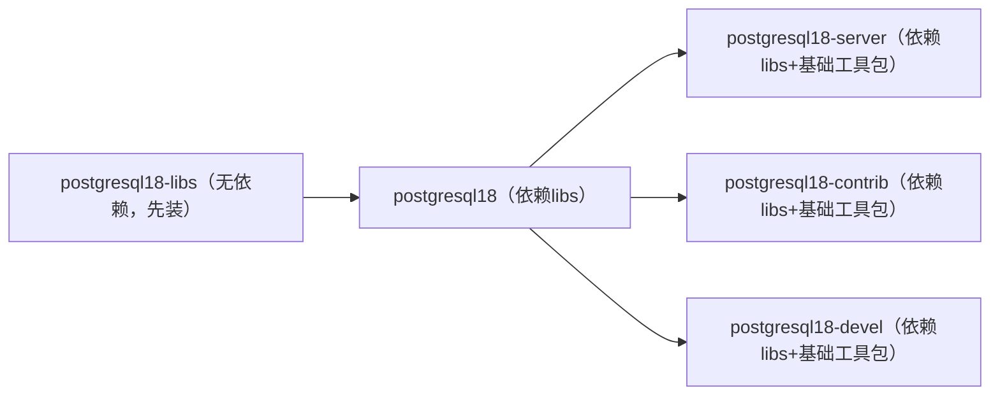

# PostgreSQL 18 核心 RPM 包对比分析（Rocky Linux 10 适配）

针对你关注的五个 PostgreSQL 18 RPM 包，以下从**核心定位、核心内容、依赖关系、适用场景、自定义安装关键作用**五个维度展开对比，帮你快速判断不同场景下需安装的包，避免冗余或缺失。

## 一、整体对比总表

| 对比维度            | `postgresql18-libs`（依赖库包） | `postgresql18`（基础工具包）         | `postgresql18-server`（服务器端包）               | `postgresql18-contrib`（扩展包）                   | `postgresql18-devel`（开发依赖包）                     |
| --------------- | ------------------------- | ----------------------------- | ------------------------------------------ | --------------------------------------------- | ----------------------------------------------- |
| **核心定位**        | 所有包的 “运行依赖基石”             | 客户端 “基础操作工具集”                 | 数据库 “核心运行引擎”                               | 功能 “扩展增强包”                                    | 开发 “编译依赖资源库”                                    |
| **是否必需（最小化安装）** | ✅ 必需（所有包依赖它）              | ✅ 客户端必需，服务器端可选                | ✅ 服务器端必需，纯客户端可选                            | ❌ 非必需（按需安装）                                   | ❌ 非必需（仅开发场景需）                                   |
| **核心内容**        | 动态库（`libpq.so` 等）、配置文件    | 客户端工具（`psql`/`pg_dump`）、基础动态库 | 服务器程序（`postmaster`）、初始化工具（`initdb`）、数据目录模板 | 扩展模块（`pg_stat_statements`）、运维工具（`pg_dumpall`） | 头文件（`libpq-fe.h`）、静态库（`libpq.a`）、`pg_config` 脚本 |
| **依赖关系**        | 无依赖（独立包）                  | 依赖 `postgresql18-libs`        | 依赖 `postgresql18` + `postgresql18-libs`    | 依赖 `postgresql18` + `postgresql18-libs`       | 依赖 `postgresql18` + `postgresql18-libs`         |
| **典型适用场景**      | 所有场景（客户端 / 服务器端 / 扩展运行）   | 纯客户端操作（连接、单库备份）               | 搭建数据库服务器（启动服务、管理数据）                        | 启用官方扩展（性能分析、全文检索）                             | 编译第三方程序（C 客户端）、开发自定义扩展                          |
| **自定义安装关键作用**   | 提供动态库，确保其他包可运行            | 提供基础客户端工具，用于连接测试              | 提供服务器核心程序，初始化自定义数据目录（`/opt/pg18/data`）     | 提供扩展模块，增强数据库功能（如慢 SQL 分析）                     | 提供编译资源，支持开发定制化工具或扩展                             |

## 二、分维度深度对比

### 1. 核心定位与功能边界

这是区分五个包的核心，明确每个包的 “不可替代作用”：

* `postgresql18-libs`：最底层的 “依赖基石”，所有 PostgreSQL 相关程序（包括 `psql`、`postmaster`、扩展模块）运行时都需要它提供的动态库（如 `libpq.so` 是客户端与服务器通信的核心库），**无它则所有包无法运行**。

* `postgresql18`：“客户端基础工具集”，聚焦 “连接与基础操作”，包含 `psql`（命令行客户端）、`pg_dump`（单库备份）、`pg_restore`（基础恢复）等，是纯客户端场景（仅连接远程数据库，不搭建本地服务器）的核心包。

* `postgresql18-server`：“数据库运行核心”，包含 `postmaster`（数据库主进程）、`initdb`（数据目录初始化工具）、`pg_ctl`（服务管理工具）等，**是搭建本地 PostgreSQL 服务器的必需包**，无它则无法启动数据库服务。

* `postgresql18-contrib`：“功能扩展增强”，在核心功能基础上补充实用工具（如 `pg_dumpall` 全库备份）和扩展模块（如 `pg_stat_statements` 性能分析、`pg_trgm` 全文检索），解决复杂业务场景需求，非必需但生产环境常用。

* `postgresql18-devel`：“开发专属依赖”，仅用于 “编译场景”，提供头文件（定义函数接口）、静态库（编译时打包到程序）、`pg_config`（获取编译参数），**无开发需求则无需安装**，安装后不影响数据库运行。

### 2. 核心内容差异（关键文件 / 工具）

通过核心内容可快速判断包的用途，避免混淆功能：

| 包名                     | 关键文件 / 工具示例                                                                                                  | 内容特点                                         |
| ---------------------- | ------------------------------------------------------------------------------------------------------------ | -------------------------------------------- |
| `postgresql18-libs`    | `/usr/pgsql-18/lib/libpq.so`（动态库）、`/usr/pgsql-18/share/postgresql.conf.sample`（配置模板）                         | 仅含 “运行时依赖”，无可直接执行的工具，不占用过多空间。                |
| `postgresql18`         | `/usr/pgsql-18/bin/psql`（命令行客户端）、`/usr/pgsql-18/bin/pg_dump`（单库备份）                                           | 以 “可执行工具” 为主，包含少量辅助动态库，聚焦 “客户端操作”。           |
| `postgresql18-server`  | `/usr/pgsql-18/bin/postmaster`（主进程）、`/usr/pgsql-18/bin/initdb`（初始化工具）、`/var/lib/pgsql/18/data`（默认数据目录模板）     | 包含 “服务器核心程序” 和 “数据目录相关资源”，是体积最大的包，决定数据库能否运行。 |
| `postgresql18-contrib` | `/usr/pgsql-18/bin/pg_dumpall`（全库备份）、`/usr/pgsql-18/share/extension/pg_stat_statements.control`（扩展配置）        | 包含 “增强工具” 和 “扩展模块”，需配合服务器端包使用，扩展功能需手动启用。     |
| `postgresql18-devel`   | `/usr/pgsql-18/include/libpq-fe.h`（头文件）、`/usr/pgsql-18/lib/libpq.a`（静态库）、`/usr/pgsql-18/bin/pg_config`（配置脚本） | 以 “编译资源” 为主，无直接运行的业务工具，仅用于开发阶段。              |

### 3. 依赖关系链：明确安装顺序

五个包存在严格的依赖顺序，自定义安装时需按 “从底层到上层” 的顺序处理，否则会报错：

* **最小安装顺序（仅搭建服务器）**：`libs` → `postgresql18` → `server`

* **生产环境安装顺序（含扩展）**：`libs` → `postgresql18` → `server` → `contrib`

* **开发环境安装顺序（含开发）**：`libs` → `postgresql18` → `server` → `contrib` → `devel`

### 4. 适用场景：按需选择，避免冗余

结合你的 Rocky Linux 10 环境，不同场景下的包选择逻辑如下：

| 场景类型                 | 需安装的包                                          | 无需安装的包                     | 核心原因                                                    |
| -------------------- | ---------------------------------------------- | -------------------------- | ------------------------------------------------------- |
| **纯客户端（仅连接远程数据库）**   | `postgresql18-libs` + `postgresql18`           | `server`、`contrib`、`devel` | 仅需 `psql` 连接工具，无需服务器核心和扩展，开发依赖更无需安装。                    |
| **基础服务器（仅运行数据库）**    | `libs` + `postgresql18` + `server`             | `contrib`、`devel`          | 满足数据存储、基础 SQL 执行需求，无复杂扩展和开发需求，减少资源占用。                   |
| **生产服务器（需扩展功能）**     | `libs` + `postgresql18` + `server` + `contrib` | `devel`                    | 需 `pg_stat_statements` 分析慢 SQL、`pg_dumpall` 全库备份，无开发需求。 |
| **开发环境（需定制工具 / 扩展）** | 所有 5 个包                                        | 无                          | 需 `devel` 包提供编译资源，开发自定义工具或扩展，同时需服务器和扩展支持测试。             |

### 5. 自定义安装（`/opt/pg18/`）关键作用

针对你自定义安装路径的需求，每个包在迁移时的核心作用不同：

* `postgresql18-libs`：迁移 `lib` 目录下的 `libpq.so` 等动态库到 `/opt/pg18/lib`，确保其他包的工具和程序能加载依赖，是自定义安装的 “基础前提”。

* `postgresql18`：迁移 `bin` 目录下的 `psql`、`pg_dump` 到 `/opt/pg18/bin`，提供自定义路径下的基础客户端操作工具，用于连接测试和单库备份。

* `postgresql18-server`：迁移 `bin` 目录下的 `initdb`、`pg_ctl` 到 `/opt/pg18/bin`，并初始化 `/opt/pg18/data` 数据目录，是自定义数据库服务的 “核心引擎”。

* `postgresql18-contrib`：迁移 `bin` 目录下的 `pg_dumpall` 和 `share/extension` 下的扩展模块到自定义路径，启用后增强数据库功能，如慢 SQL 分析。

* `postgresql18-devel`：迁移 `include` 目录（头文件）、`lib` 目录（静态库）、`bin/pg_config` 到自定义路径，为开发自定义工具或扩展提供编译资源，仅开发场景需迁移。

## 二、典型疑问解答（结合对比场景）

### 1. 为什么 `postgresql18-libs` 是所有场景都必需的？

因为它包含的 `libpq.so`（客户端通信库）、`libpgcommon.so`（通用功能库）是所有 PostgreSQL 相关程序的 “运行基础”—— 无论是 `psql` 客户端、`postmaster` 服务器进程，还是 `pg_dumpall` 工具，运行时都需要加载这些动态库，缺失则会报 “找不到库文件” 错误。

### 2. 能否跳过 `postgresql18` 直接安装 `server`？

不能。因为 `postgresql18-server` 依赖 `postgresql18` 提供的基础工具和部分动态库（如 `pg_dump` 的依赖库），直接安装会触发 RPM 依赖检查报错；且 `server` 初始化后，需 `postgresql18` 的 `psql` 工具连接测试，跳过会导致无法验证安装结果。

### 3. 生产环境为什么建议安装 `contrib` 而不是 `devel`？

`contrib` 提供的 `pg_stat_statements`（性能分析）、`pg_dumpall`（全库备份）、`pg_trgm`（全文检索）是生产环境高频需求，能解决实际业务问题；而 `devel` 仅提供编译资源，生产环境无需开发或编译操作，安装后会占用额外空间，且可能增加安全风险（如头文件泄露配置信息）。

### 4. 自定义安装时，哪个包迁移错误会导致数据库无法启动？

`postgresql18-server` 和 `postgresql18-libs` 是关键 ——`libs` 迁移错误会导致 `server` 的 `postmaster` 进程无法加载依赖库，直接启动失败；`server` 的 `initdb` 工具迁移错误或数据目录初始化异常，会导致服务启动后无法识别数据文件，报 “数据目录损坏” 错误。

> （注：文档部分内容可能由 AI 生成）